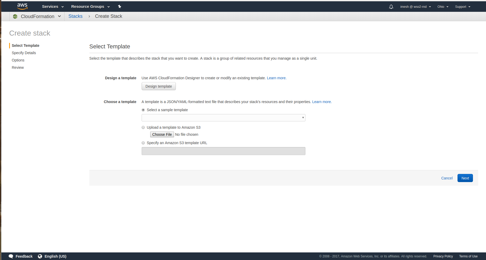
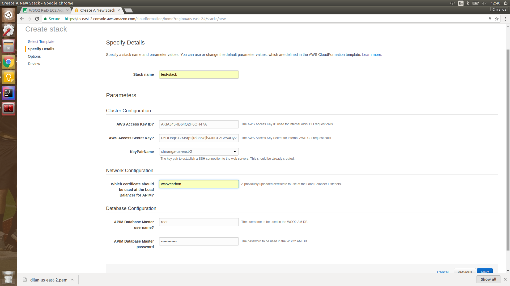
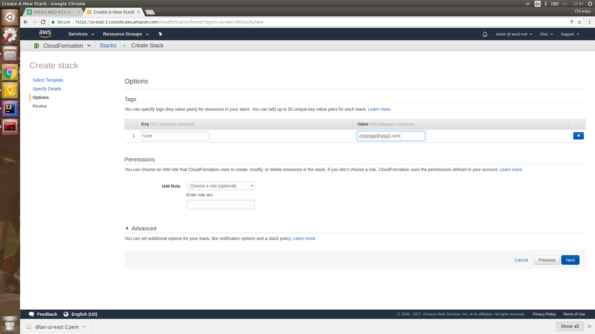
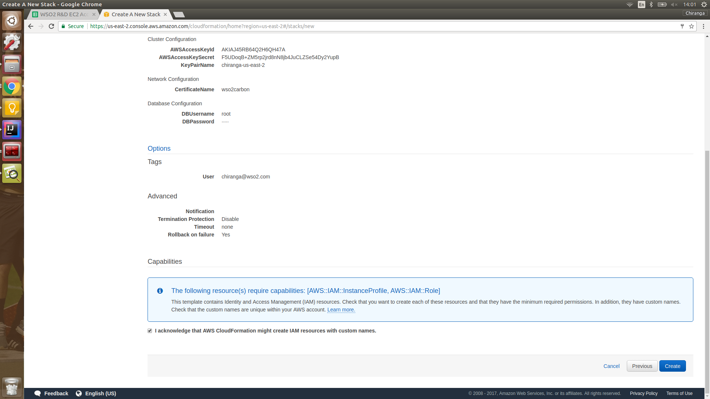

# WSO2 API Manager CloudFormation Templates

This repository contains CloudFormation templates for deploying WSO2 API Manager on AWS.

##Steps to follow

1. Go to AWS Management Console.

2. Choose Services -> Management Tools -> CloudFormation service.

3. Choose to Create new stack.

4. Under Select Template tab, go to Choose a template and choose Upload a template to Amazon S3 option. Then choose a new template file from your local filesystem.

5. Select Next, after choosing the template file.

6. Enter a desired Stack name.

7. Under parameters,

    7.1. Enter your AWS Access Key ID.
    
    7.2. Enter your AWS Access Key Secret.
    
    7.3. Choose a desired AWS key pair name of your choice, belonging to the region in which you are running the stack.
    
    7.4. Enter 'wso2carbon' as the certificate at the load balancer for APIM.
    
    7.5. If desired, change the WSO2 APIM database master username and/or master password.
    
8. Select Next.

9. [Optional] Enter tag(s), if desired.

10. Select Next.

11. Choose option 'I acknowledge that AWS CloudFormation might create IAM resources with custom names.', at the bottom.

12. Choose to Create.

