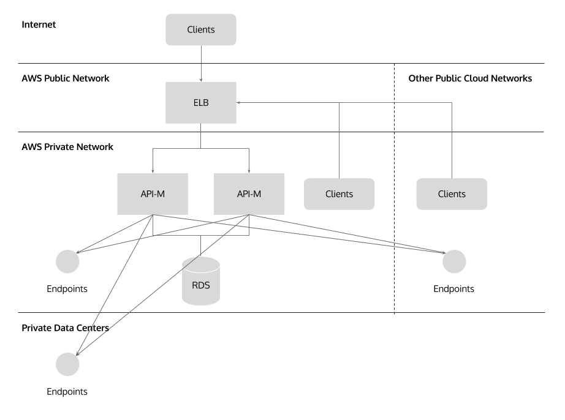

# WSO2 API Manager All-In-One CloudFormation Template

This CloudFormation template can be used for deploying WSO2 API Manager (API-M) on AWS with all-in-one profile. A RDS database instance will be created for storage.

### Deployment Architecture

### AWS Resources Used

- WSO2APIMLoadBalancer
  
  An Elastic Load Balancer has been used for exposing API Manager Publisher, Store user interfaces, and Gateway endpoint.

- WSO2APIMSecurityGroup
  
  This security group defines rules for disabling direct access to to the virtual machine(s) and allowing the load balancer to route HTTP requests to the API Manager.

- WSO2APIMAutoscalingGroup
  
  An autoscaling group has been used for providing autohealing for API Manager.

- WSO2APIMLaunchConfig
  
  The launch configuration defines instructions for installing pre-requisites and API Manager.

- WSO2APIMDBSecurityGroup
  
  This database security group will be used if input parameter UseRDSDBInstance is set to true for creating a RDS MySQL database instance.

- WSO2APIMDBInstance
  
  A RDS MySQL database instance will be created if input parameter UseRDSDBInstance is set to true.

## Input Parameters

- AvailabilityZone

  Availability zone to be used

- SSLCertificateName

  The name of the SSL certificate to be used in the load balancer for HTTPS access.

- DBPassword

  The API manager database admin account password.

- DBRootPassword

  The API manager database root account password.

