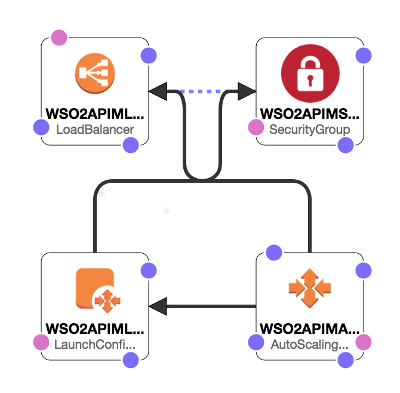
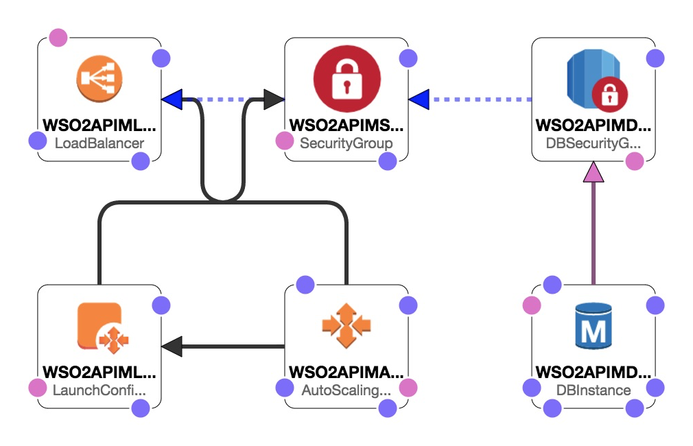

# WSO2 API Manager All-In-One CloudFormation Template

This CloudFormation template can be used for deploying WSO2 API Manager (API-M) on AWS with all-in-one profile. There are two approaches in which this template can be used:

  - Approach 1: Installing a MySQL database instance on the virtual machine
  - Approach 2: Using an RDS MySQL database instance

## Approach 1

### Deployment Architecture

### AWS Resources Used

- WSO2APIMLoadBalancer
  
  An Elastic Load Balancer has been used for exposing API Manager Publisher, Store user interfaces, and Gateway endpoint.

- WSO2APIMSecurityGroup
  
  This security group defines rules for disabling direct access to to the virtual machine(s) and allowing the load balancer to route HTTP requests to the API Manager.

- WSO2APIMAutoscalingGroup
  
  An autoscaling group has been used for providing autohealing for API Manager.

- WSO2APIMLaunchConfig
  
  The launch configuration defines instructions for installing pre-requisites and API Manager.

## Approach 2

### Deployment Architecture

### AWS Resources Used

- WSO2APIMLoadBalancer
  
  An Elastic Load Balancer has been used for exposing API Manager Publisher, Store user interfaces, and Gateway endpoint.

- WSO2APIMSecurityGroup
  
  This security group defines rules for disabling direct access to to the virtual machine(s) and allowing the load balancer to route HTTP requests to the API Manager.

- WSO2APIMAutoscalingGroup
  
  An autoscaling group has been used for providing autohealing for API Manager.

- WSO2APIMLaunchConfig
  
  The launch configuration defines instructions for installing pre-requisites and API Manager.

- WSO2APIMDBSecurityGroup
  
  This database security group will be used if input parameter UseRDSDBInstance is set to true for creating a RDS MySQL database instance.

- WSO2APIMDBInstance
  
  A RDS MySQL database instance will be created if input parameter UseRDSDBInstance is set to true.

## Input Parameters

- AvailabilityZone

  Availability zone to be used

- KeyName

  The name of an existing EC2 KeyPair to enable SSH access to the instances.

- InstanceType

  The EC2 instance type to be used for API Manager virtual machine.

- SSHLocation

  The IP address range that can be used to SSH to the EC2 instances

- SSLCertificateName

  The name of the SSL certificate to be used in the load balancer for HTTPS access.

- DBClass

  The RDS database instance type.

- DBName

  The API manager database name.

- DBUser

  The API manager database admin account username.

- DBPassword

  The API manager database admin account password.

- DBRootPassword

  The API manager database root account password.

- WSO2APIMCapacity

  The initial number of API manager instances.

- DBAllocatedStorage

  The size of the database in Gb.

- UseRDSDBInstance

  If set to true, create a RDS database instance for data persistence. Else create a MySQL
  server instance in the virtual machine.
